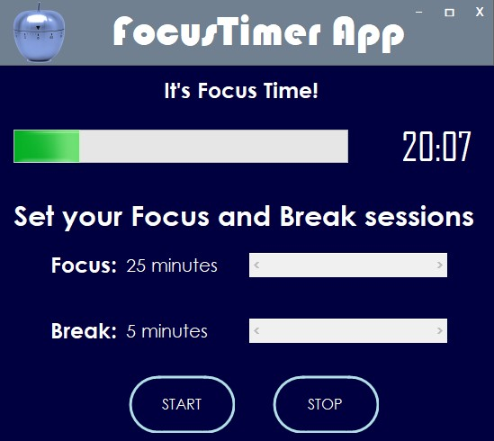

# FocusTimer App - Pomodoro Clock

<h1 align="center">
    
</h1>

<!--  -->

<p align="center"> FocusTimer App Window<p>

---

### Table of Contents
<!-- You're sections headers will be used to reference location of destination. -->

- [Description](#description)
- [How To Use](#how-to-use)
- [Useful links and resources](#Useful-links-and-resources)
- [License](#license)
- [Author Info](#author-info)

---

## Description

The Pomodoro Technique is a time management method developed by Francesco Cirillo in the late 1980s. The technique uses a timer to break down work into intervals (traditionally 25 minutes in length) separated by short breaks (traditionally 5 minutes).

The FocusTimer App lets you configure a Focus and a Break time, with a maximum duration of 1 hour each. That way, you can prepare yourself psychologically to have a more focused work session, knowing that you'll also get to take regular breaks. This will bolster your motivation and keep you creative to complete a task within a set period of time.

Transform time from being an enemy to being an ally.

#### Technologies

- Windows Forms
- C#

[Back To The Top](#focustimer-app---pomodoro-clock)

---

## How To Use

* Set a duration for your Focus and Break sessions (or only one of them)
* Press Start button and the timer will start running
* If you set up both Focus and Break sessions, the app will automatically start running your Break session after the Focus session is over
* A sound will play everytime the progress bar is complete / the timer hits 00:00
* You can hit the Stop button at any time to cancel the activty


<!-- #### Installation -->


<!-- 
#### API Reference

```html
    <p>dummy code</p>
```
[Back To The Top](#read-me-template) -->

---

## Useful links and resources

-   More about the [Pomodoro Technique](https://en.m.wikipedia.org/wiki/Pomodoro_Technique)

[Back To The Top](#focustimer-app---pomodoro-clock)

---

## License

MIT License

Copyright &copy; [2020] [Patricia Canuto Vieira da Costa]

[Back To The Top](#focustimer-app---pomodoro-clock)

---

## Author Info

- LinkedIn - [Patricia Costa](https://www.linkedin.com/in/patricia-costa-885038a0/)

[Back To The Top](#focustimer-app---pomodoro-clock)